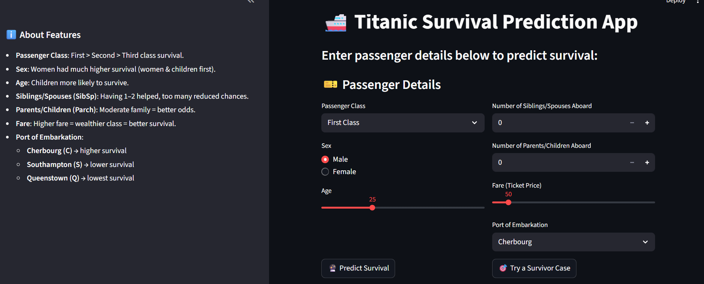

# 🚢 Titanic Survival Prediction App


[](https://www.python.org/)
[](https://streamlit.io/)
[](https://www.docker.com/)

A **machine learning-based Streamlit web application** to predict Titanic passenger survival based on personal and travel details. Built as an **end-to-end ML project** with Docker deployment.

---

## 🖼 Project Preview



---

## 🧠 Features

- Predict survival using:
  - Passenger Class: First, Second, Third
  - Sex
  - Age
  - Number of Siblings/Spouses aboard
  - Number of Parents/Children aboard
  - Fare
  - Port of Embarkation: Cherbourg, Queenstown, Southampton
- Interactive **Streamlit UI** with probability display
- Model trained with **hyperparameter tuning**
- Containerized deployment using **Docker**
- Clean, modern UI with **responsive design**

---

⚙️ Quick Start
1️⃣ Clone the Repository

Run the following commands in your terminal:

git clone https://github.com/Alan21303/titanic-end2end-ml.git
cd titanic-end2end-ml

2️⃣ Build Docker Image

Make sure you have Docker installed. Then build the image:

docker build -t titanic-app:latest .

3️⃣ Run the Container

Start the Docker container to launch the app:

docker run -p 8501:8501 titanic-app:latest

After running, open your browser and go to:
http://localhost:8501

📂 Project Structure
titanic-end2end-ml/
│
├── asset/ # Images for README & app
│ ├── hero.jpg # Banner image
│ └── image.png # Streamlit interface screenshot
├── data/ # Raw & processed datasets
├── model/ # Trained ML model
├── notebooks/ # Jupyter notebooks: EDA & training
├── src/ # Python source code
├── Dockerfile # Docker config
├── requirements.txt # Python dependencies
├── streamlit_app.py # Streamlit web app
└── README.md # Project documentation

4️⃣ Install Python Dependencies (Optional)

If you want to run the app without Docker, first create a virtual environment and install dependencies:

python -m venv venv
.\venv\Scripts\activate # Windows

# source venv/bin/activate # macOS/Linux

pip install -r requirements.txt

Then run the Streamlit app:

streamlit run streamlit_app.py

### 📈 How It Works

User inputs details on the Streamlit UI.

ML model predicts survival probability.

Results are shown interactively with clear success/failure messages.

### 🚀 Tech Stack

Python 3.10

Pandas, NumPy, Scikit-learn, Joblib

Streamlit for UI

Docker for containerization

### 🏗 Future Enhancements

Deploy on AWS / Heroku / Azure

Add historical dataset visualizations

Implement multiple model comparisons for accuracy

Enhance UI/UX with more interactivity
EOF

```

```
